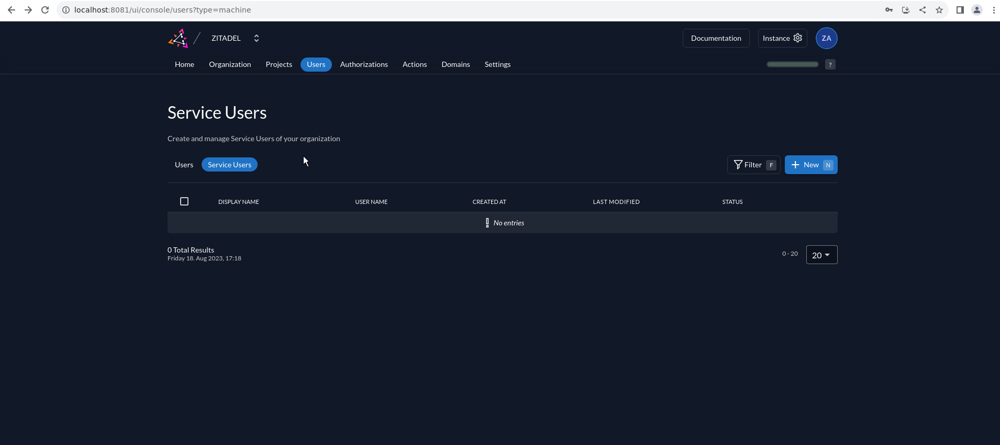
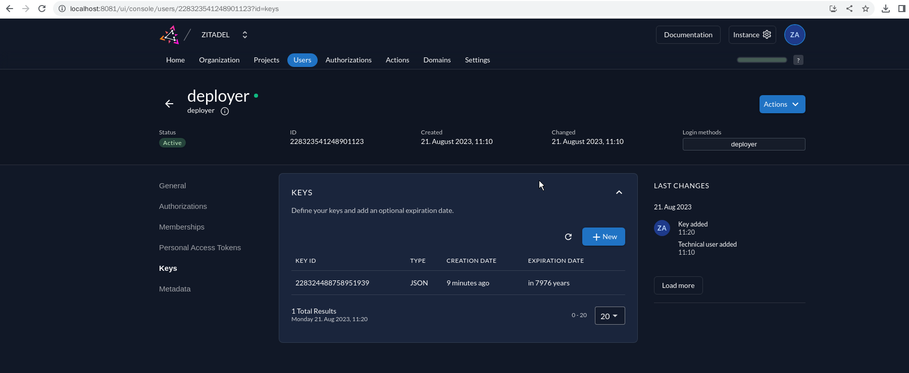
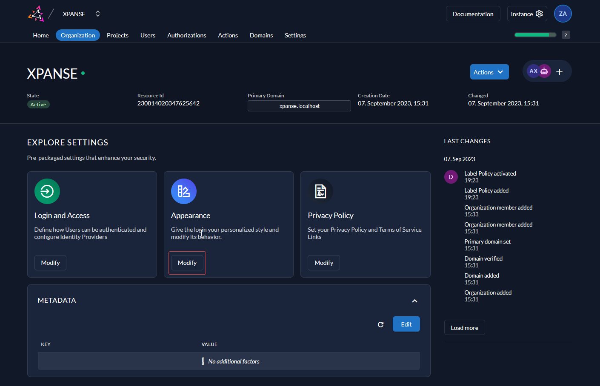
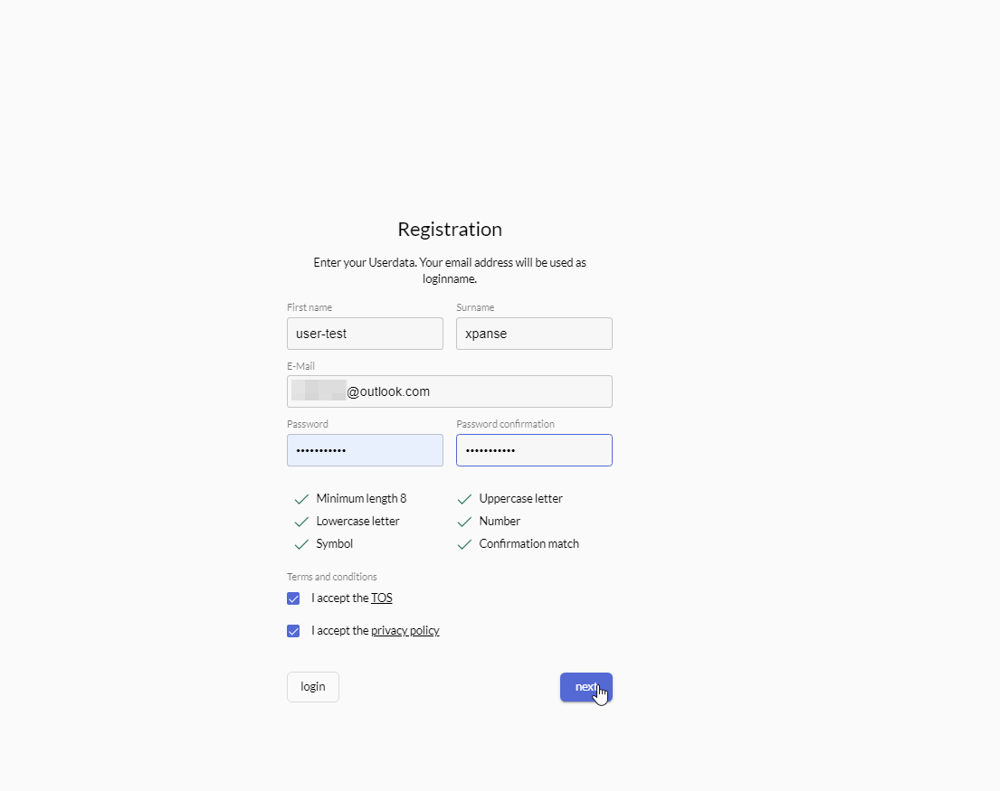
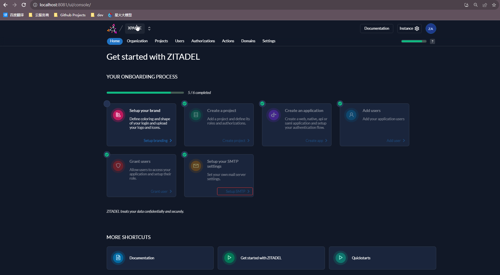
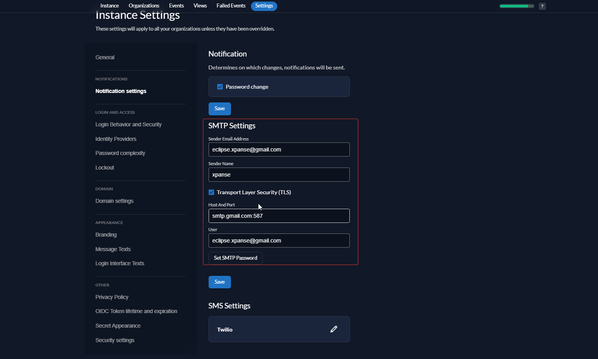

# Deploy and Configure Zitadel Service Instance for Xpanse

This document will describe how to use docker to build a service instance of Zitadel, how to use Terraform scripts to
initialize the configuration required for applications access to the service instance of Zitadel, and how to configure the
applications xpanse and xpanse-ui to access the service instance of Zitadel. After completing all these steps, we can
config the xpanse project with the service instance of Zitadel.

## Deploy Zitadel Service Instance

Here are two types of service instance deployment solutions. You can deploy a local service instance of Zitadel according 
to the document [local-installation-steps.md](local/local-installation-steps.md) or deploy a production service instance of 
Zitadel according to the document [testbed-installation-steps.md](testlab/testbed-installation-steps.md).

When you can log in to the console of the deployed Zitadel service instance using the default administrator user, 
it means that the deployment is successful.

## Initialize the configuration for Applications.

When you can log in to the console of the deployed Zitadel service instance using the default administrator user,
do the following steps to initialize the configuration for applications of Xpanse.

### Add Service User and Get Credential File

Before running Terraform Scripts to initialize the configuration, we need to add a service user as a manager of the
instance, and download the credential file for the authentication which needed for running terraform script.

1. Create a new service user.

The default administrator user login logged in successfully, click on `Users`,`Service User`, and `+ New N` items on the console
in sequence to open page `Create a New User`.

Fill in user information and select `JWT` as `Access Token Type`, then click the button `Create` to create the new
service user.


2. Get json file of the secret key added for the new service user.

After the service user is successfully created, click on the `Keys` label and then click on the `Create` button to open
the pop-up window `Add Key`.

On the pop-up window `Add key`, select the item `JSON`  as `Type` and click on the `Add` button to create the json file.

Then click on the `Download` button in the pop-up window to save the JSON file. After the file download is completed,
click on the `Close` button to close the pop-up window.


3. Set the service user as a manager of the instance.

Click on the `Instance` button with the settings icon in the upper right corner of the page to switch to the instance
management page.


Click on the `+` button to open the `Add a Manager` pop-up window, then click on the name of newly created service user
as item under the `Loginname` and tick the `Iam Owner` as role. Finally, click on the `Add` button to finish this step.


### Run Terraform Scripts to initialize the configuration

Enter the directory 'zitadel/terraform' under the project:

```shell
cd zitadel/terraform
 ```
#### Config SMTP to Enable User Registration
Add SMTP config to enable the function 'User Registration' of Zitadel service.
Fill all variables with suffix 'smtp_' in [terraform.tfvars](terraform/terraform.tfvars).

Read the document 'README.md' in the directory 'zitadel/terraform' and check preparation before running terraform
scripts. What we need to pay attention to completing as below:

* Copy the json file we have already downloaded to the path and rename it to 'local-token.json'.
* Use the 'local.ftvars' to connect to the local service instance of Zitadel as below:

```shell
terraform init
terraform plan -var-file=environments/local.tfvars
terraform apply -auto-approve -var-file=environments/local.tfvars
```

After successfully executing the Terraform script, the Terraform outputs is as below:


The default administrator user login the console of Zitadel to view added configurations:


### Manual Configuration on Console

Due to an open bug in Zitadel-Terraform-Provider, we are not able to complete following settings and must be done manually for now.

1. Set organization `XPANSE` as default.
   Open the organization management page, Click on the option 'Set as default organization' of the newly created organization named `XPANSE` in the list of `ORGANIZATIONS`,
   then click on the name `XPANSE` to open the manage page of organization `XPANSE`.
   
2. Set appearance of organization `XPANSE`.
   Click the button `Modify` in the box `Appearance` on the opened manage page of organization `XPANSE`.
   
3. Upload logo and icon both in `Light Model` and `Dark Model`. The required logos and icons in the path[terraform/static/](terraform/static)
   

## Add Users for Xpanse

After completing the steps in [Manual Configuration on Console](#Manual Configuration on Console), you can add users for xpanse in the following two ways:

### Add Admin User for Xpanse

To facilitate local development of the xpanse project, it is necessary to create an admin user with all roles of
'xpanse'. Do following action to crate the admin user on the console:

1. Click on the menu `Users` and the `+ New` button on the console in sequence to open page `Create a New User` as below.
   
2. Fill all required fields and then click the button `Create` to create the new user.
   

> Note: The user created by admin user first login requires a password change, please remember the new password.
> If you want to create an end user without email, just select the role 'user' only or undo the following grant operation.

Follow the steps below to grant all roles of the project `eclipse-xpanse` for the new admin user:
1. Select item `Authorizations` under the user and then click on the button `+ New N` to start the grant;
   
2. Select the project `eclipse-xpanse` and then click on the button `Continue`;
   
3. Select all roles to the grant and then clock on the button `Save`;
   
   4.After completing the grant above, user has roles as below:
   

### Register End User for Xpanse

1. Click the button `register` on the login page of Zitadel console to open the page `Registration`.
   
2. Enter user data and then click button `next`.
   
3. Check the newly received email sent from the address of SMTP. If you received the email contains the code, copy the code to fill in the box and then click button `next`.
   

> Note: When no email is received within 1 minute, you can click the button `resend code`. After trying again a few times, if you haven't received the email yet, please check the
configuration of SMTP as the following operation.

### Check SMTP Settings
1. Click `Setup SMTP` on the home page.
   
2. Check all filled value in item `SMTP Settings`. If all values are valid, click `Set SMTP Password` to reset password.
   
3. After checking all settings of SMTP are valid. Retry to register user again.

## Run Applications of Xpanse with service instance of Zitadel

### Configure and run the API service of Xpanse

Clone project [xpanse](https://github.com/eclipse-xpanse/xpanse.git) from remote to workspace in local machine, then
enter the root path.

```shell
git clone https://github.com/eclipse-xpanse/xpanse.git
cd xpanse
```

Then compile the entire project using the below command:

```shell
mvn clean install -DskipTests=true
```

Start the application using the below command line. Fill the value for each variable with the value of same item in the
Terraform Outputs.

```shell
java -jar runtime/target/xpanse-runtime-1.0.0-SNAPSHOT.jar \
--authorization-token-type=${authorization-token-type}
--authorization-api-client-id=${authorization-api-client-id} \
--authorization-api-client-secret=${authorization-api-client-secret} \
--authorization-swagger-ui-client-id=${authorization-api-swagger-ui-cleint-id}
```

> Note: Copy the value for each variable without quotes `"` from same item in the Terraform Outputs.

After the service is successfully started, open internet browser and navigate to URL of Swagger UI
http://localhost:8080/swagger-ui/index.html. Authorize on the page of Swagger UI as below:

The browser will redirect to the login page of service instance of Zitadel with URL http://localhost:8081/ui/login/login.
Use the created admin user to login and call all APIs on the Swagger UI after successful login.

### Configure and run the UI client of Xpanse.

Clone project [xpanse-ui](https://github.com/eclipse-xpanse/xpanse-ui.git) from remote to workspace in local machine,
then enter the root path.

```shell
git clone https://github.com/eclipse-xpanse/xpanse-ui.git
cd xpanse-ui
```

Set `REACT_APP_ZITADEL_CLIENT_ID` environment variable with the value of same item in the Terraform Outputs, then run
the below command to start UI client.

```shell
npm install
npm start
```

After the service is successfully started, open internet browser and navigate to http://localhost:3000. The browser will
redirect to the login page of the service instance of Zitadel. Login with the created admin user of xpanse.


Now you can use the admin user to develop project 'xpanse' in local machine.